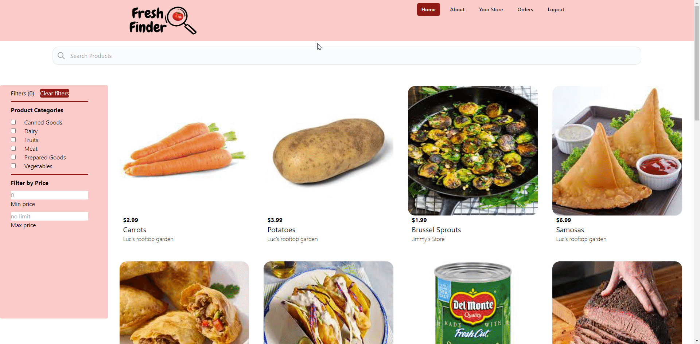

# Fresh Finder
  
  [](https://opensource.org/licenses/MIT)
  
  ## Description
  
  Fresh Finder is an online marketplace for local food that connects consumers with local farmers, producers, and artisans in their area. This application provides a convenient way for people to access fresh, locally sourced products without having to visit physical farmers' markets or stores. Users can browse through a wide range of food items, including fruits, vegetables, meats, dairy products, baked goods, and more. Our marketplace prioritizes sustainability, supporting small-scale farmers, and promoting organic or ethically produced food. Fresh Finder offers opportunity to enjoy the benefits of fresh food while supporting local small businesses.

  Tech Stack:
  - Front End: React.js, HTML5, CSS, Tailwind CSS
  - Back End: Express, Node.js, graphQL, Apollo 
  - Database: MongoDB

  Link to deployed app: https://market-place-app.onrender.com
  
  ## Table of Contents
  
  - [Installation](#installation)
  - [Usage](#usage)
  - [Credits](#credits)
  - [License](#license)
  - [How-to-contribute](#how-to-contribute)
  
  ## Installation
  if you would like to run this app on your own code space. 
  Make sure to have node installed.

  Install the npm packages by running the following command 

  ```bash
  npm install
  ```

  ## Usage
  User can search for products in the database by navigating on the homepage, applying any filters or search using the search  bar. See below for a demonstration

  User can list their own product button and can add other use's products into their order. If the user is not logged in, they will be prompt to do so. The user is able to create an account and stay logged in for the duration of the session

    

  if you are running this app on your own code space:

  Before starting the server, the database needs to be seeded by:

  ```bash
  $ npm run seed
  ```

  Start the application by:

  ```bash
  $ npm run develop
  ```
  
  ## Credits
  
  Team members: 
  - Beatriz Bravo - [BeaBravo](https://github.com/BeaBravo)
  - Nick Catalano - [NicholasCatalano](https://github.com/nicholascatalano)
  - Luc Tourangeau - [TurtleNav](https://github.com/TurtleNav)
  - Yuliya Tsoy - [YuliyaTsoy](https://github.com/YuliyaTsoy)
  - Anthony McDonald - [TJamesMcDonald](https://github.com/tjamesmcdonald)

  
  ## License
  This application is covered under [MIT](https://choosealicense.com/licenses/mit/) license
  
  
  ## How to Contribute
 If you would like to contribute to our project, you can find the repo on https://github.com/YuliyaTsoy/food-marketplace-app
